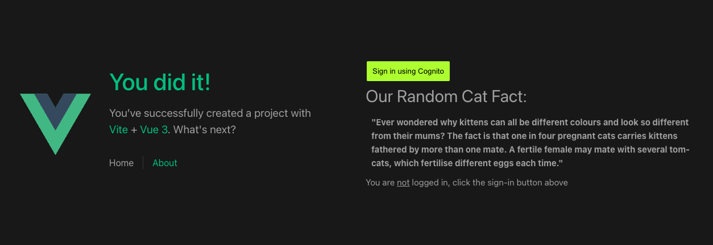
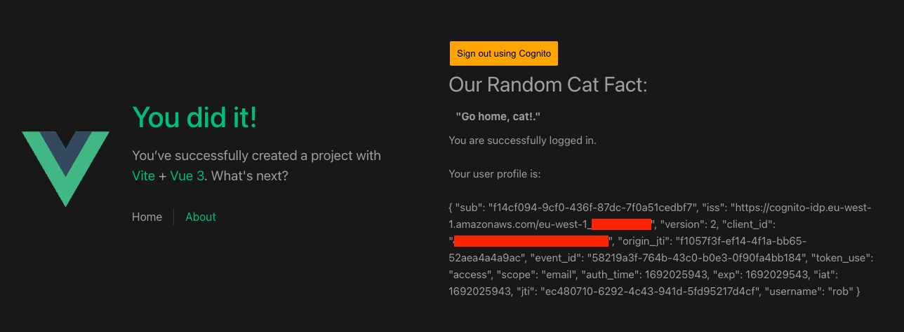

# Single Page Application

This app has been built to demonstrate the Authorisation Code Flow with Prrof Key for Code Exchange (PKCE) - https://auth0.com/docs/get-started/authentication-and-authorization-flow/authorization-code-flow-with-proof-key-for-code-exchange-pkce

We will use VueJS as the SPA frontend, with AWS Cognito as the backend (which can be found here https://github.com/rbulmer55/spa-cognito-auth-be)



## Authorisation Flow with PKCE (using AWS Cognito)

The Sign in button routes to our Login route `src/router/index.ts`:

```
  {
      path: '/login',
      name: 'login',
      beforeEnter(to, from, next) {
        const userStore = useUserStore()

        // get PKCE challenge and verifier for SPA
        generatePKCETokens().then((res) => {
          userStore.setPKCETokens(res.code_challenge, res.code_verifier)
          // redirect to cognito authorise endpoint
          const url = getAuthorizationCode(userStore.pkceChallenge)
          window.location.href = `${url}`

        })
        next('/login')
      },
      component: HomeView
    },
```

The route generates the tokens before redirecting the user onto the AWS Cognito Hosted UI for the Authorisation Code Flow (passing the PKCE challenge).

On a successful redirect to our other route, we use the authorisation code and pass the verifier to the cognito `/oauth/token` endpoint to get the users access token

```
{
      path: '/login/oauth2/code/cognito',
      beforeEnter(to, from, next) {
        const userStore = useUserStore()

        // store authorisation code from caller
        if (!to.query.code?.toString()) {
          next('/login')
        }
        const code = to.query.code?.toString() || ''

        // call cognito to retieve users
        getAccesstoken(code, userStore.pkceVerifier).then((res) => {
          if (res) {
            userStore.setCognitoInfo(res.data)
          }
        })

        next('/')
      },
      component: HomeView
    },
```

Now we're logged in we can read the users token on the UI...



# vue-project

This template should help get you started developing with Vue 3 in Vite.

## Recommended IDE Setup

[VSCode](https://code.visualstudio.com/) + [Volar](https://marketplace.visualstudio.com/items?itemName=Vue.volar) (and disable Vetur) + [TypeScript Vue Plugin (Volar)](https://marketplace.visualstudio.com/items?itemName=Vue.vscode-typescript-vue-plugin).

## Type Support for `.vue` Imports in TS

TypeScript cannot handle type information for `.vue` imports by default, so we replace the `tsc` CLI with `vue-tsc` for type checking. In editors, we need [TypeScript Vue Plugin (Volar)](https://marketplace.visualstudio.com/items?itemName=Vue.vscode-typescript-vue-plugin) to make the TypeScript language service aware of `.vue` types.

If the standalone TypeScript plugin doesn't feel fast enough to you, Volar has also implemented a [Take Over Mode](https://github.com/johnsoncodehk/volar/discussions/471#discussioncomment-1361669) that is more performant. You can enable it by the following steps:

1. Disable the built-in TypeScript Extension
   1. Run `Extensions: Show Built-in Extensions` from VSCode's command palette
   2. Find `TypeScript and JavaScript Language Features`, right click and select `Disable (Workspace)`
2. Reload the VSCode window by running `Developer: Reload Window` from the command palette.

## Customize configuration

See [Vite Configuration Reference](https://vitejs.dev/config/).

## Project Setup

```sh
npm install
```

### Compile and Hot-Reload for Development

```sh
npm run dev
```

### Type-Check, Compile and Minify for Production

```sh
npm run build
```

### Lint with [ESLint](https://eslint.org/)

```sh
npm run lint
```
